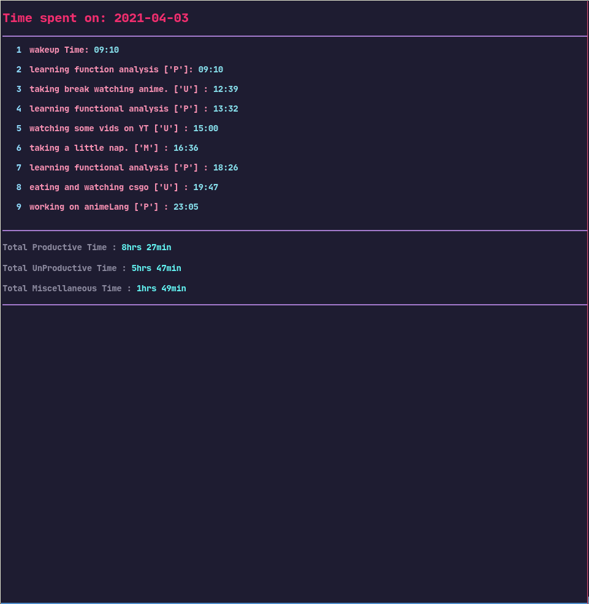
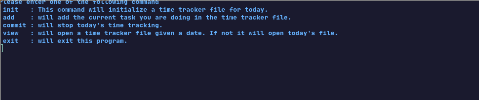

#### A Simple program That keeps record of your daily time.

It creates a html file with current date and saves all of your activites.

It classifies activities under 3 categories :
1. Productive
2. UnProductive
3. Miscellaneous

At the end of the day it you can just "commit" this tracker file and it will automatically. Calculate how much it you spent under each category.

TimeTracker

I created this program to track how i use my daily time and It helps me to know what i was doing in which day.

##### Installation
clone this repo
> git clone https://github.com/IAmPara0x/TimeTracker
> And Add This folder to your path.
